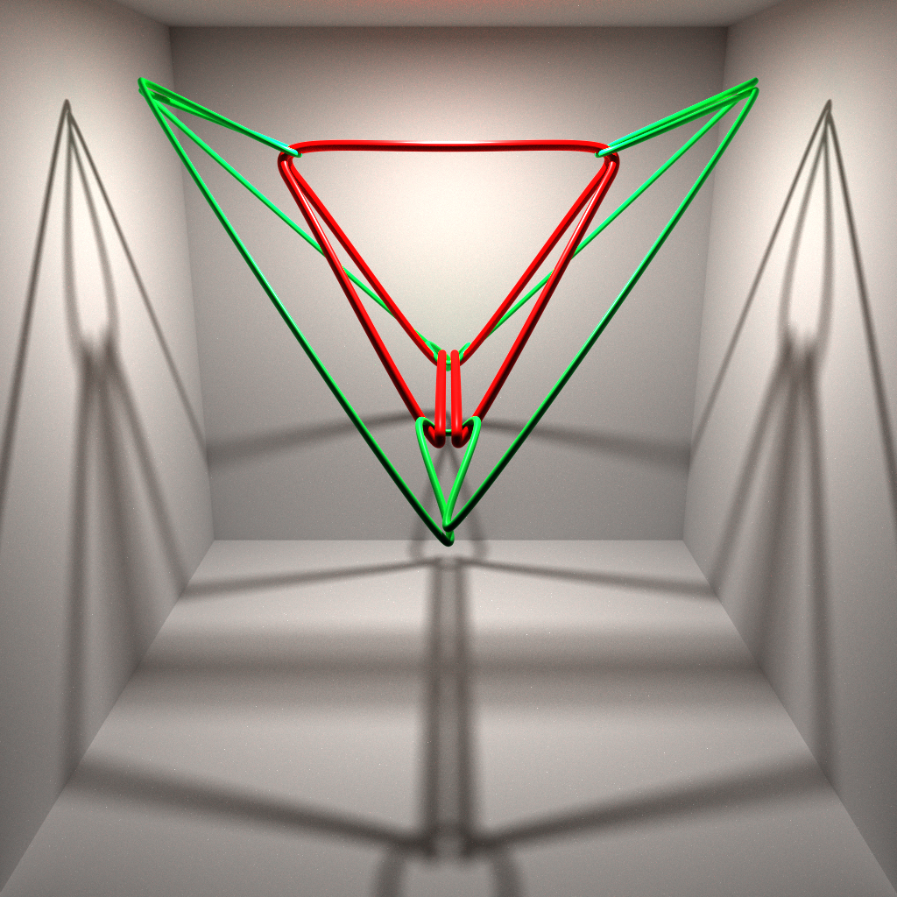

# rtcamp11
This repository contains the renderer submitted to [rtcamp11](https://sites.google.com/view/rtcamp11).

## Submission
[[Video](submission/video.mp4)] [[Slides](submission/alpine.pdf)]
- CPU
- Resolution: 768x768
- Samples: 64
- FPS: 24
- Duration: 10s
- Accelerator: BVH8 (Rebuild every frame)

## Build
Follow the [build instructions](https://github.com/ms-elk/alpine/tree/5ef8137389fc06edad3ddcd65a879ebe9dd43886?tab=readme-ov-file#build-instructions) for `alpine`, but run CMake in the root directory of `rtcamp11` instead of `alpine`.

## Implementation
`main.cpp` was implemented based on [rtcamp11_setup](https://github.com/shocker-0x15/rtcamp_setup/tree/rtcamp11/samples/cpu_renderer)